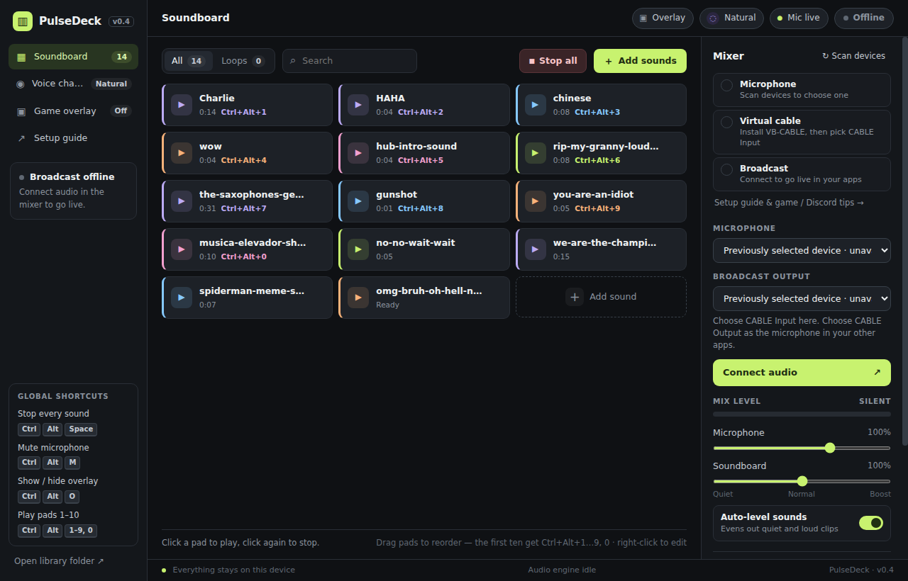

# PulseDeck

A local Mac and Windows soundboard, microphone mixer, voice changer, and replay buffer — for Discord, game chat, streaming, and calls. No accounts, no uploads, no telemetry: everything stays on your computer.



## What it does

- **Soundboard** — drop in MP3/WAV/OGG/M4A/FLAC/WebM files, drag pads to reorder them, and play them with a click or a global shortcut (`Ctrl+Alt+1…9, 0` follow the first ten pads). Auto-leveling evens out quiet and loud clips so they all come through in voice chat.
- **Voice changer** — 25 presets (pitch shifts, monsters, robots, radios, rooms…) plus an extra-pitch slider and effect-strength blend. Preview yourself in your headphones before going live.
- **Replay buffer** — keeps the last 30 s–3 min of everything you hear (friends on Discord, game chat, the game itself). Press `Ctrl+Alt+R` to save it, trim it on a waveform, and add it to the soundboard.
- **Game overlay** — a small always-on-top deck (`Ctrl+Alt+O`) you can click while playing.
- **Mixer** — separate microphone and soundboard levels, mute, headphone monitoring, and a setup checklist.

On Windows, PulseDeck sends your mixed voice and sounds into a **virtual audio cable** ([VB-CABLE](https://vb-audio.com/Cable/), free), and any app that accepts a Windows microphone — Discord, OBS, Steam, games, Zoom, browsers — picks it up as `CABLE Output`.

## Install on Mac

Requires macOS 14.2 or later. Apple silicon is the primary tested Mac target.

1. Open the Mac `.dmg` and drag PulseDeck into Applications.
2. Install [BlackHole 2ch](https://existential.audio/blackhole/) once. Complete the administrator prompt and restart when instructed.
3. Open PulseDeck, click **Scan devices**, and allow microphone access. Choose your physical microphone and **BlackHole 2ch** as the broadcast output. Select physical headphones for monitoring.
4. Click **Connect audio**. In Zoom or another calling app, select **BlackHole 2ch** as its microphone and your headphones as its speaker output.
5. In Zoom, choose **Original sound for musicians** and enable it in the meeting so effects and music are not filtered out.

The replay buffer requests Mac system-audio capture access separately. Allow PulseDeck under **System Settings → Privacy & Security → Screen & System Audio Recording** if prompted. The buffer keeps audio in memory until you save a clip; it does not save screen video. Use the packaged app for capture testing, because running from a terminal can attribute permissions to the terminal instead.

Mac shortcuts use **Command + Option** instead of Control + Alt on Windows. Closing the main window leaves PulseDeck and its audio running; click its Dock icon to reopen, or use **PulseDeck → Quit PulseDeck** to stop it. The overlay is configured to appear across desktops and full-screen spaces.

Local Mac builds use ad-hoc signing and manual updates. Developer ID signed, notarized releases support automatic updates. See [Mac setup and verification](docs/mac-setup.md).

## Install on Windows

Download **PulseDeck-Setup.exe** from the [latest release](../../releases/latest) and run it. Installed copies check for updates automatically and offer a one-click restart when a new version is ready.

Prefer a portable copy? Grab **PulseDeck-Portable.zip**, unzip it anywhere, and run `PulseDeck.exe`. The portable build keeps its data in a `PulseDeck Data` folder next to the exe and does not auto-update.

> Windows SmartScreen may warn about an unsigned app on first launch — click **More info → Run anyway**. See [DISTRIBUTION.md](DISTRIBUTION.md) for code signing.

Then follow the in-app **Setup guide**: install VB-CABLE once, pick your mic and `CABLE Input` in the mixer, click **Connect audio**, and choose `CABLE Output` as the microphone in your other apps.

## Develop

Requires Node.js 22+; Mac packaging requires a Mac with Xcode command-line tools.

```bash
npm ci          # install dependencies (downloads Electron)
npm start       # run from source
npm test        # library tests + voice DSP checks + desktop integration tests
npm run dist    # build the Windows installer and portable zip into dist/
npm run dist:mac:local # build a personal Apple silicon DMG and ZIP on a Mac
npm run dist:mac       # build Mac distribution packages using configured signing
npm run test:package   # launch and inspect the packaged app
```

The desktop tests drive the real app with Playwright; on Linux run them under `xvfb-run -a`. Audio devices are simulated in tests; the mixing, DSP, capture lifecycle, persistence, overlay, and UI are real.

### Project layout

| File | Purpose |
| --- | --- |
| `main.cjs` | Electron main process: windows, global shortcuts, IPC, overlay, auto-updates |
| `preload.cjs`, `overlay-preload.cjs` | The narrow bridges the renderer windows are allowed to use |
| `library.cjs` | Sound library, captures, and settings persistence (`library.json`) |
| `renderer.js`, `index.html`, `style.css` | The main window |
| `audio.js` | Web Audio engine: mixing, limiter, monitoring, replay ring buffer |
| `voice-effects.js`, `voice-presets.json` | Voice changer DSP graph and presets |
| `replay-worklet.js`, `wav.js` | Ring-buffer audio worklet and WAV helpers |
| `overlay.html`, `overlay.js`, `overlay.css` | The always-on-top game overlay |
| `tests/` | Automated checks |
| `.github/workflows/` | CI tests and tagged releases |

## Releasing

See [DISTRIBUTION.md](DISTRIBUTION.md). In short: bump the version, push a `vX.Y.Z` tag, and GitHub Actions builds the installer, publishes the release, and every installed copy updates itself.

## License

[MIT](LICENSE) © Isaac Hollow Horn Bear
